# Beam Data Flows

This document describes the runtime data flows of Samply.Beam in the order they occur: broker and proxy initialization, task and result exchange (including SSE streaming), socket usage, background maintenance, and health monitoring.

## Table of Contents

- [1. Initialization](#1-initialization)
  - [Broker Initialization](#broker-initialization)
  - [Proxy Startup](#proxy-startup)
  - [Certificate Retrieval](#certificate-retrieval)
- [2. Task and Result Exchange](#2-task-and-result-exchange)
  - [Task Creation](#task-creation)
  - [Task Retrieval](#task-retrieval)
  - [Result Creation](#result-creation)
  - [Result Retrieval (Long-Polling)](#result-retrieval-long-polling)
  - [Result Retrieval (SSE Streaming)](#result-retrieval-sse-streaming)
- [3. Socket Usage](#3-socket-usage)
  - [Socket Creation (Initiator Side)](#socket-creation-initiator-side)
  - [Socket Retrieval (Receiver Side)](#socket-retrieval-receiver-side)
- [4. Background Processes](#4-background-processes)
  - [Task and Result Expiry](#task-and-result-expiry)
- [5. Health Monitoring](#5-health-monitoring)
  - [Health Check Endpoints](#health-check-endpoints)

---

## 1. Initialization

### Broker Initialization

The broker starts serving requests immediately after binding its port, but reports itself as unhealthy until the CA chain has been fetched from Vault. Certificate cache warm-up and Vault retries happen concurrently with request handling.

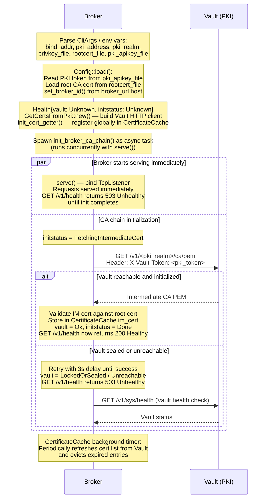

### Proxy Startup

The proxy performs a health check against the broker before attempting any PKI work. All PKI steps use the same exponential-backoff retry logic. Once the certificate chain is validated the proxy starts the HTTP server and opens the long-lived control channel to the broker.

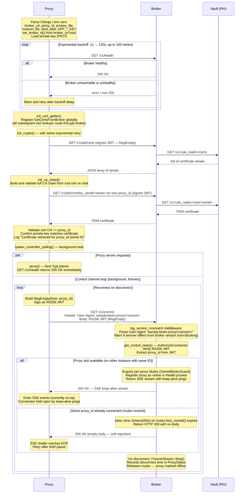

### Certificate Retrieval

Used during proxy startup (CA chain bootstrap, own-cert validation) and during every task/result encryption step when a recipient's public key must be fetched. All three PKI endpoints share the same JWT-authenticated relay pattern through the broker.

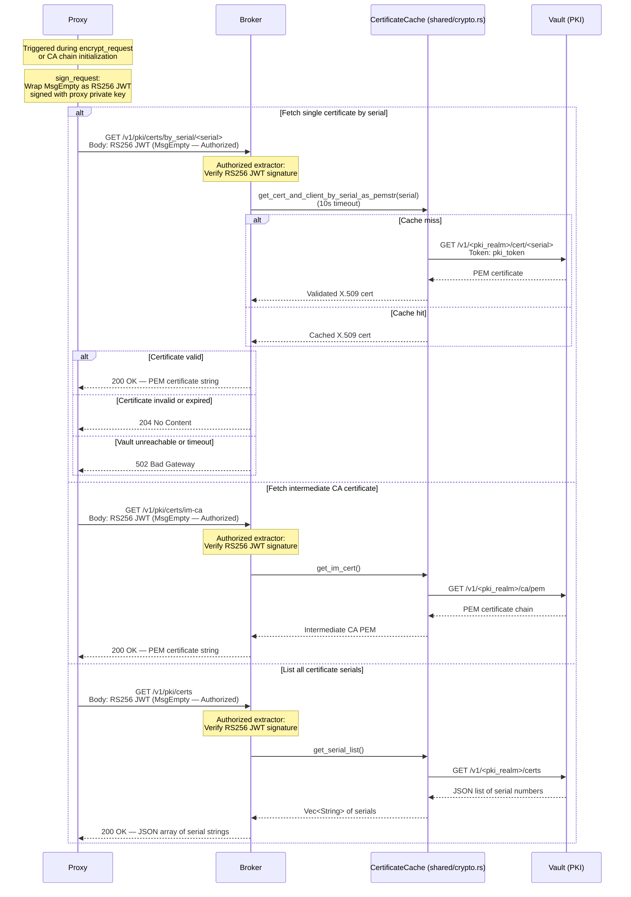

---

## 2. Task and Result Exchange

All message bodies are end-to-end encrypted at the proxy: the broker stores and forwards ciphertext only. Every proxy-to-broker request is signed as an RS256 JWT; the broker verifies the signature against Vault on every request.

### Task Creation

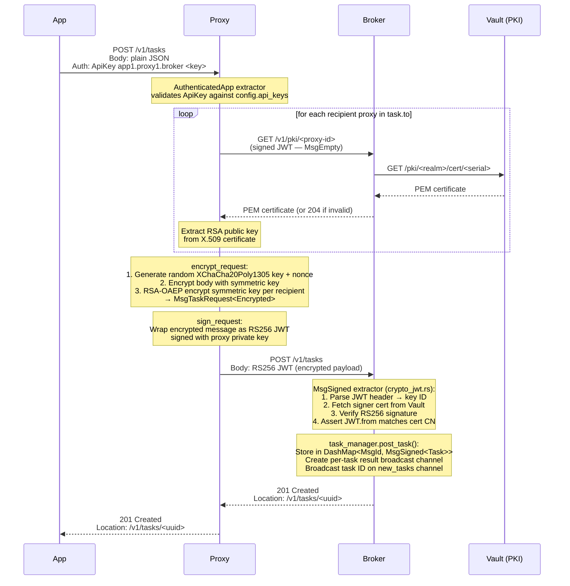

### Task Retrieval

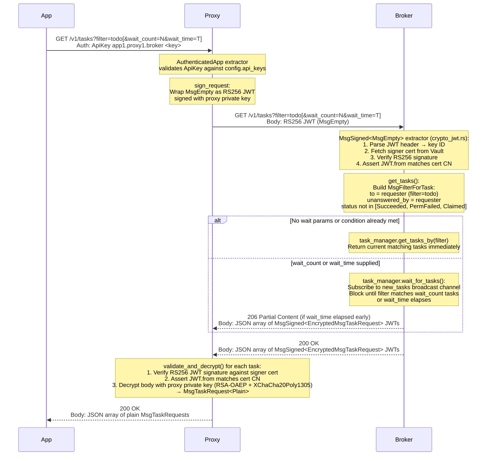

### Result Creation

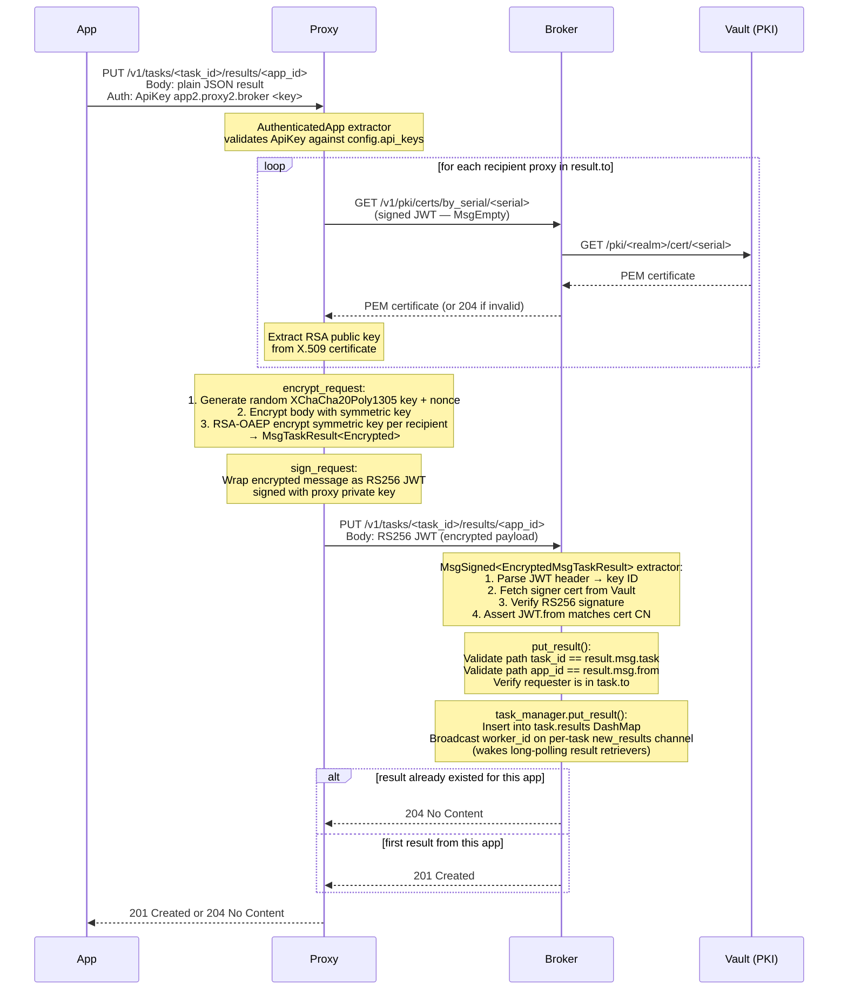

### Result Retrieval (Long-Polling)

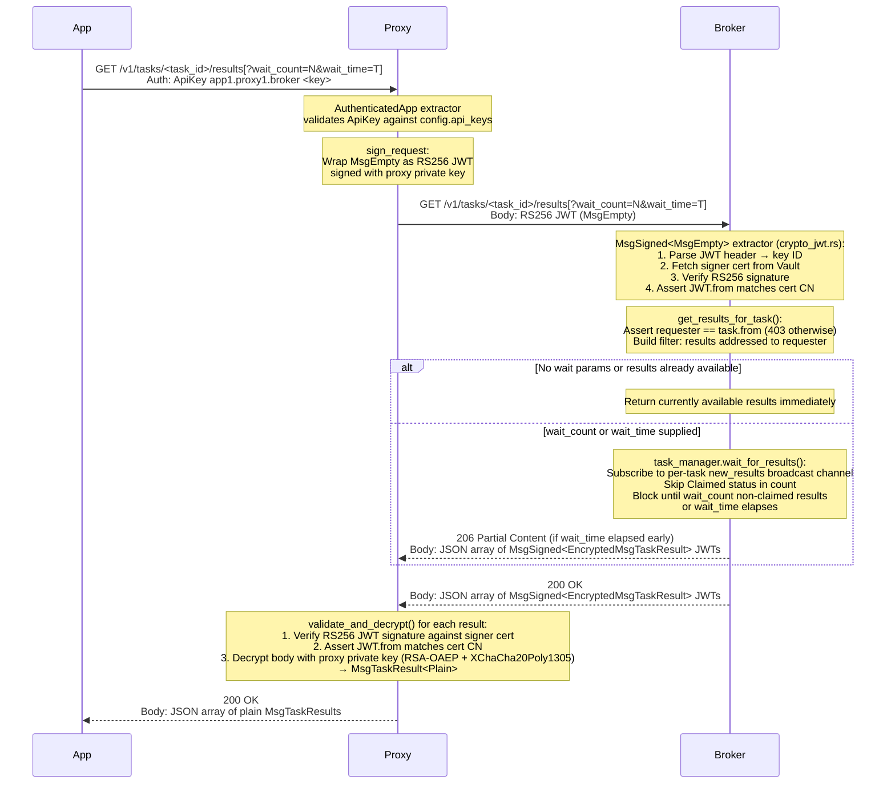

### Result Retrieval (SSE Streaming)

Adding `Accept: text/event-stream` switches from a single blocking response to an open SSE stream. The broker pushes each result as a `new_result` event as soon as it arrives; the proxy decrypts inline before forwarding to the app. The stream carries control events (`wait_expired`, `deleted_task`, `error`) that require no decryption.

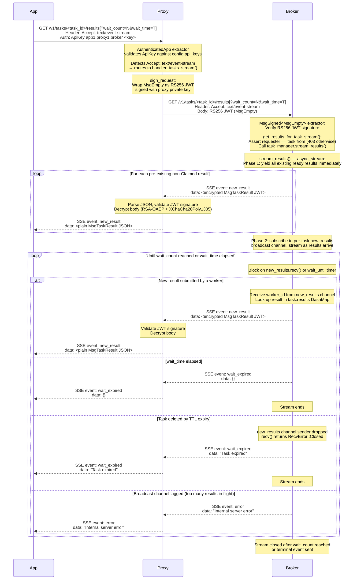

---

## 3. Socket Usage

Sockets require the `sockets` feature compiled into both proxy and broker. The initiating proxy embeds a freshly generated encryption key inside the end-to-end encrypted `MsgSocketRequest`; the receiving proxy extracts it after decryption. Both proxies then wrap their broker-side TCP connections in a streaming XChaCha20Poly1305 cipher with that key, so the broker relays ciphertext only.

### Socket Creation (Initiator Side)

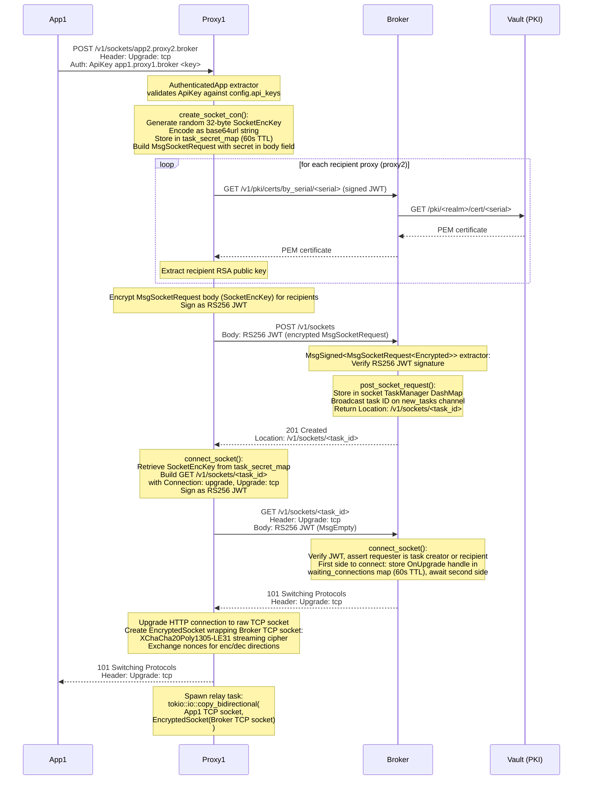

### Socket Retrieval (Receiver Side)

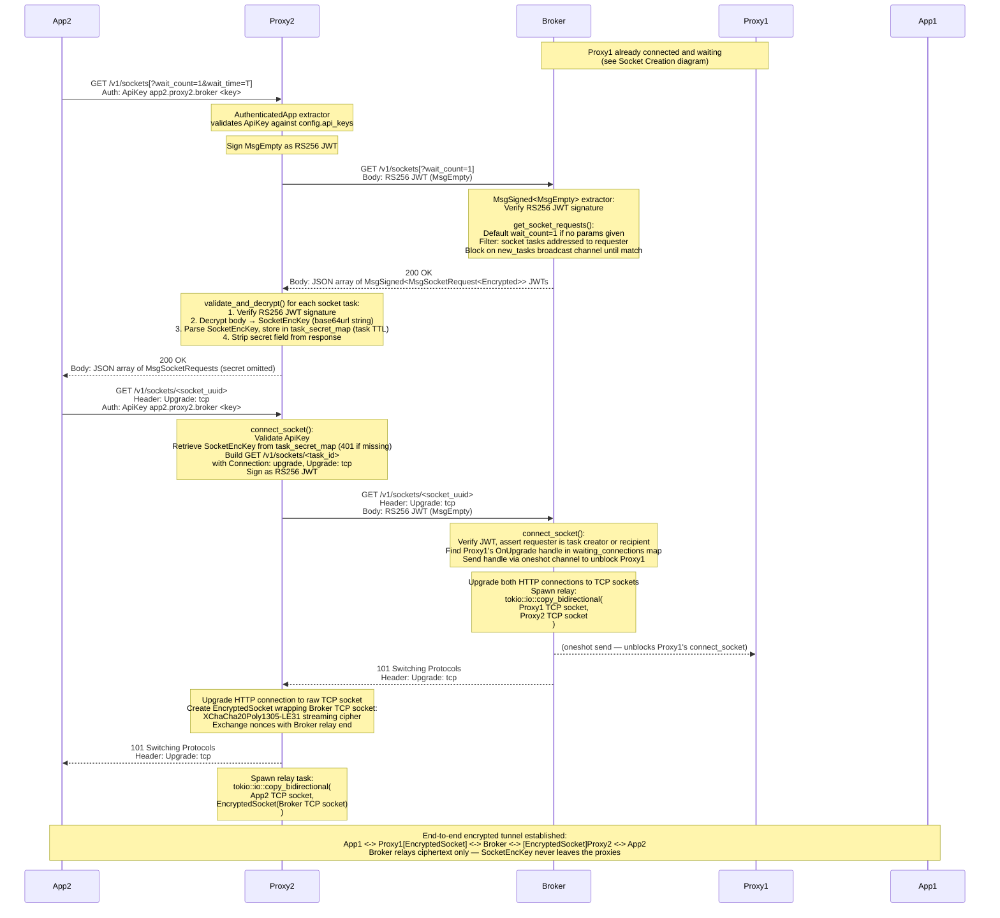

---

## 4. Background Processes

### Task and Result Expiry

Each `TaskManager` instance (one for tasks, one for sockets) runs a dedicated OS thread that sweeps for expired entries every five minutes. The sweep is separate from expiry filtering: `get_tasks_by` already excludes expired tasks on every read, so expiry is logically immediate. The background thread's job is to reclaim memory and close broadcast channels, which in turn terminates any open SSE streams and long-poll waits on expired tasks.

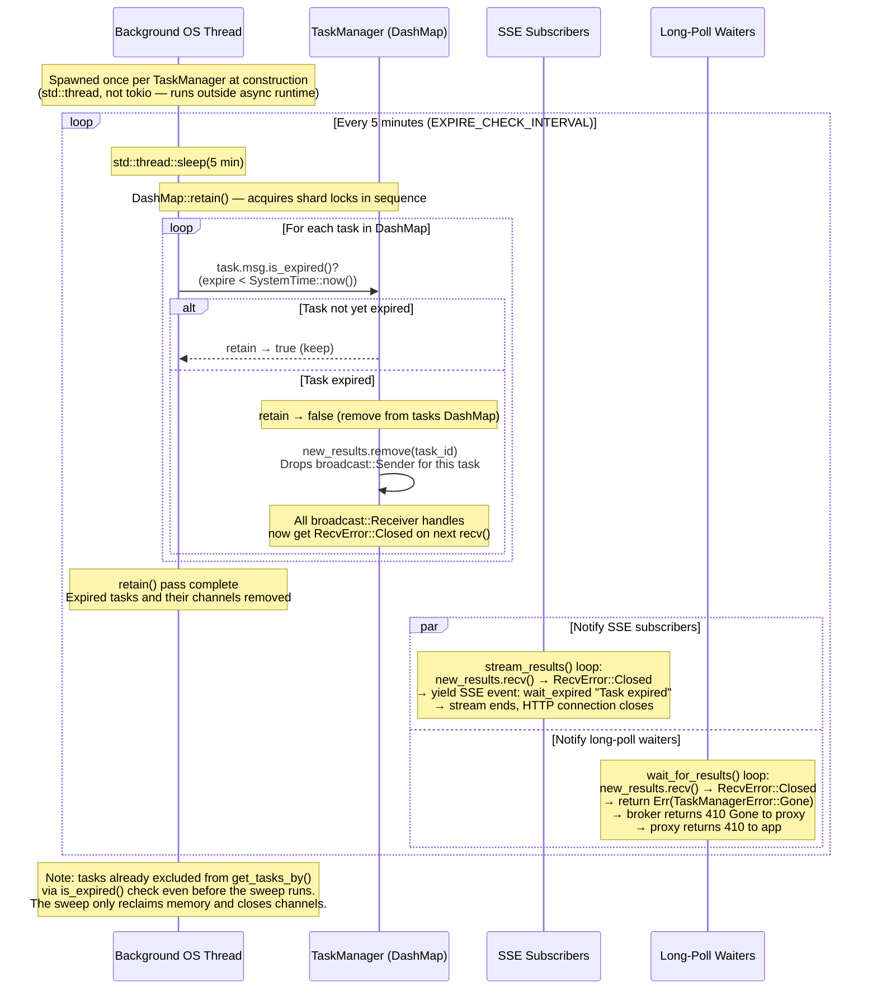

---

## 5. Health Monitoring

### Health Check Endpoints

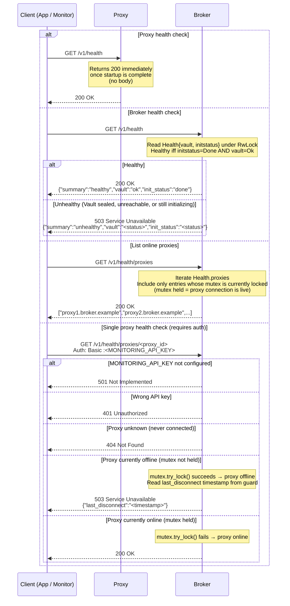
