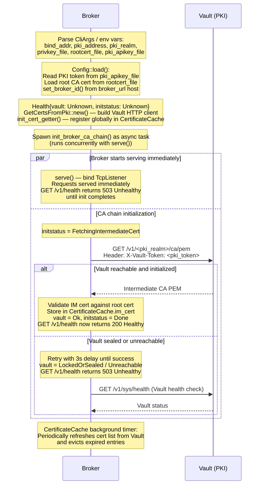
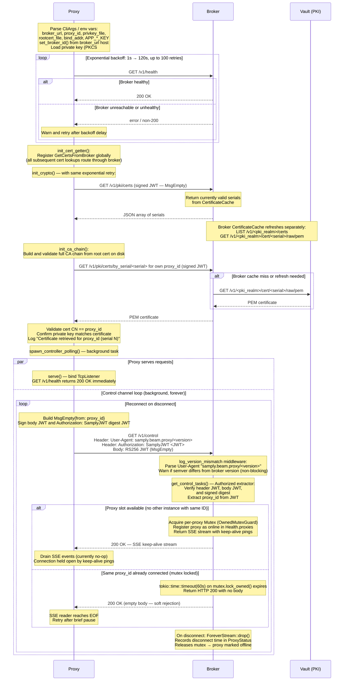
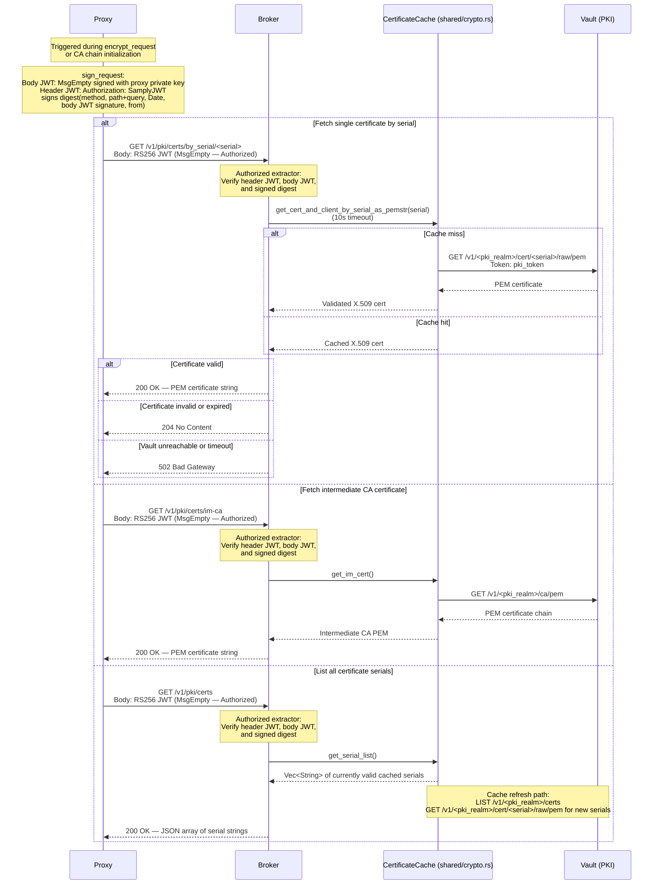
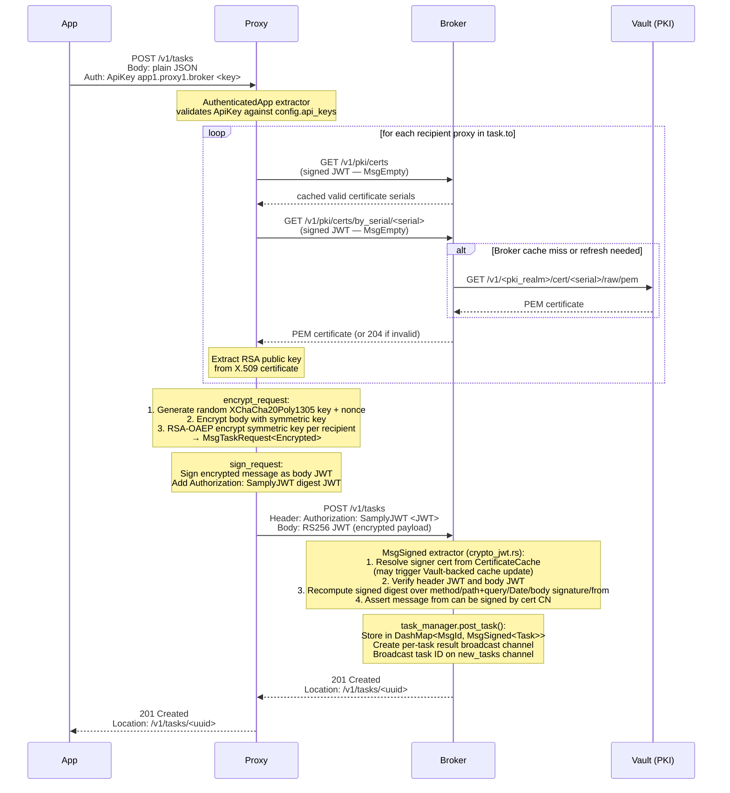
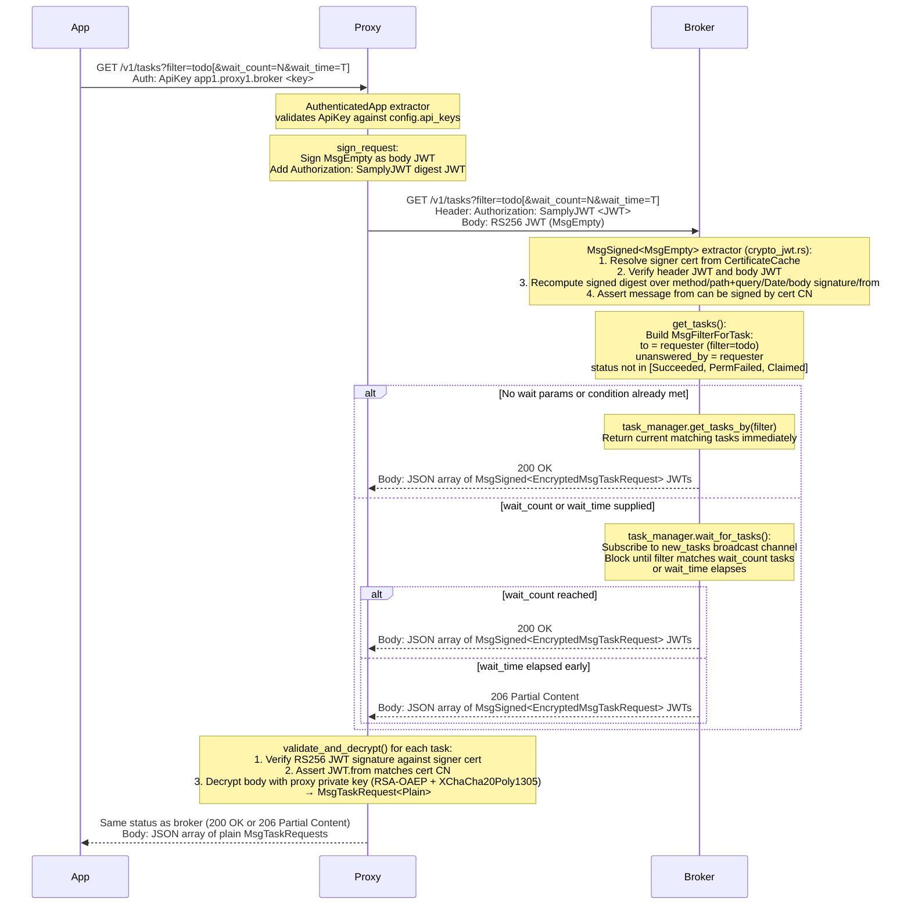
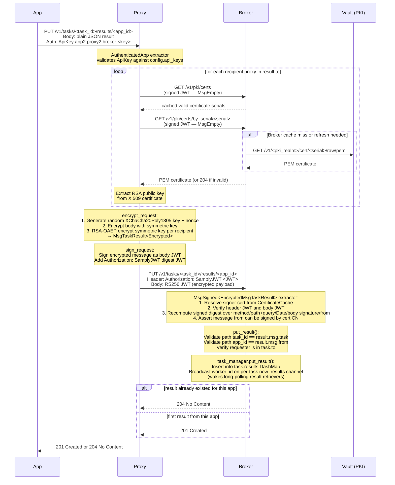
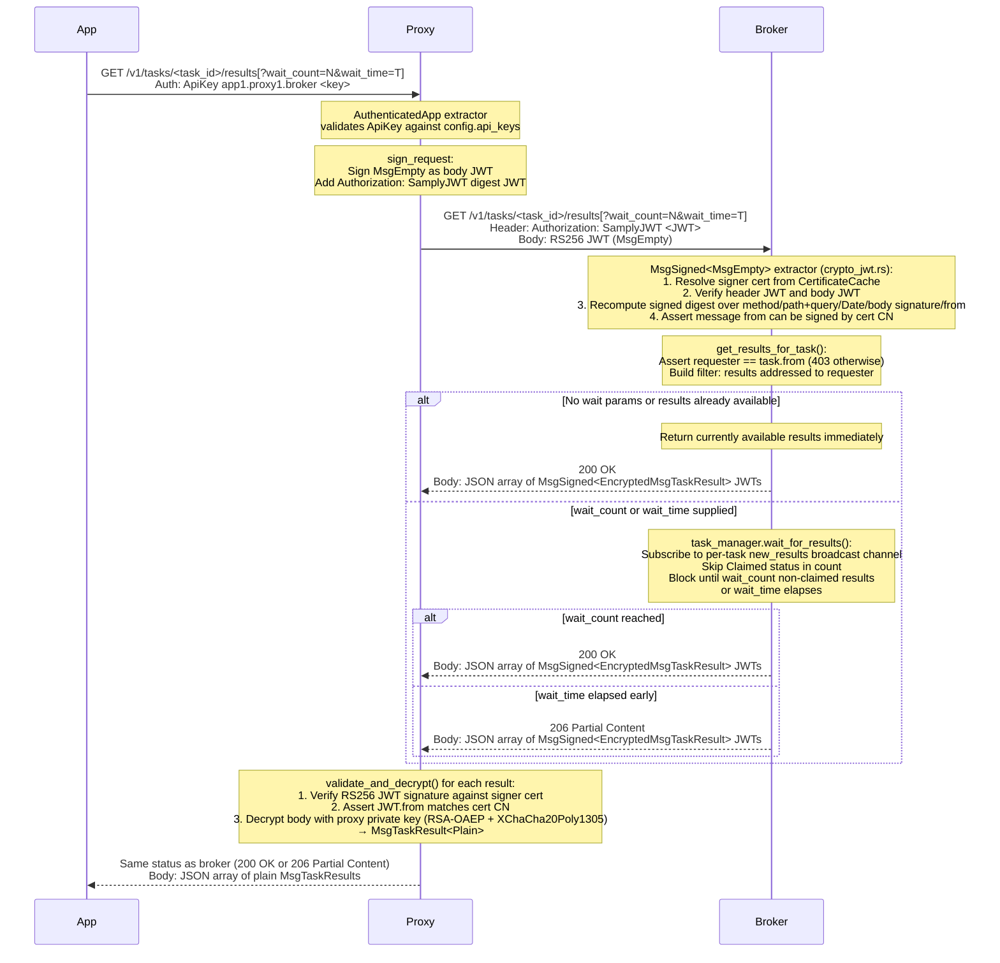
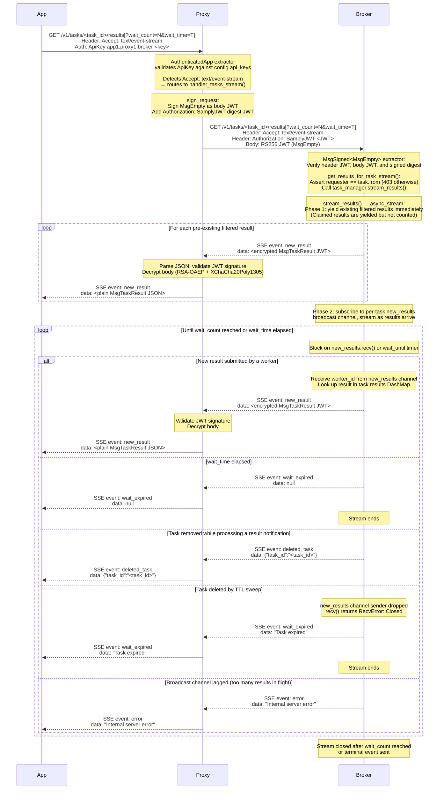
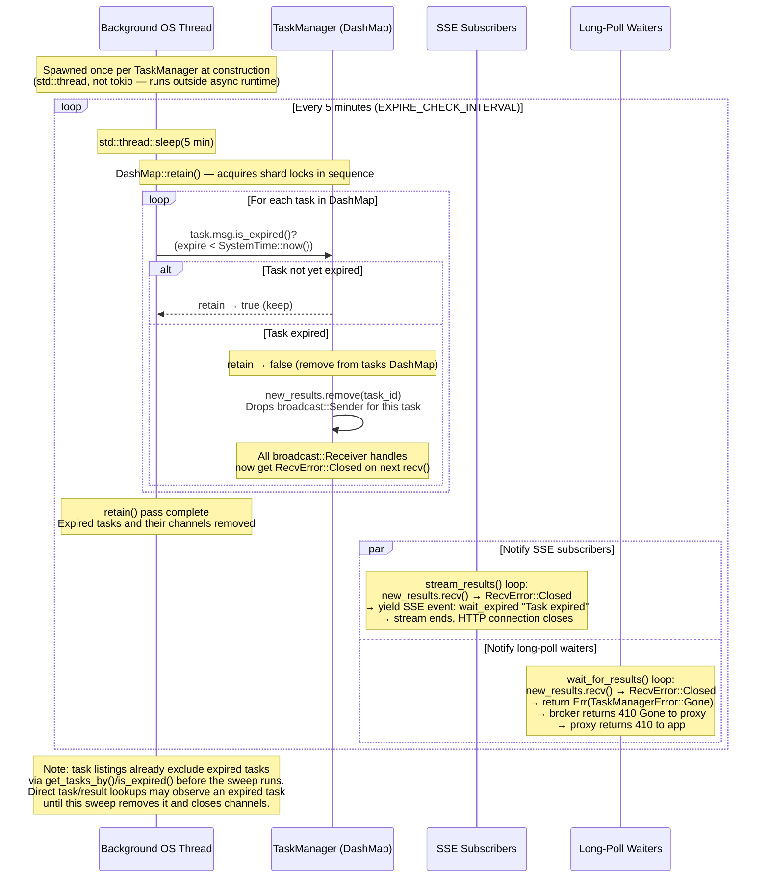
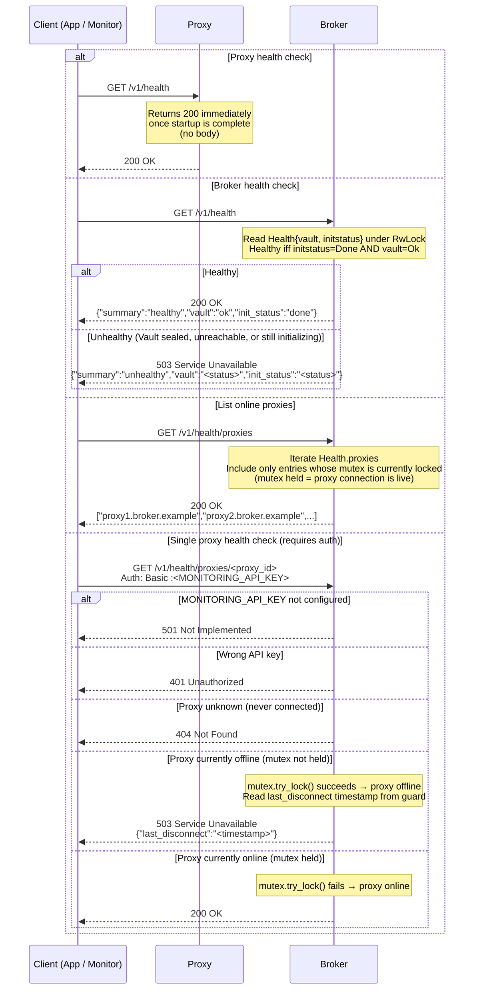

# Beam Data Flows

This document describes the runtime data flows of Samply.Beam in the order they occur: broker and proxy initialization, task and result exchange (including SSE streaming), socket usage, background maintenance, and health monitoring.

## Table of Contents

- [1. Initialization](#1-initialization)
  - [Broker Initialization](#broker-initialization)
  - [Proxy Startup](#proxy-startup)
  - [Certificate Retrieval](#certificate-retrieval)
- [2. Task and Result Exchange](#2-task-and-result-exchange)
  - [Task Creation](#task-creation)
  - [Task Retrieval](#task-retrieval)
  - [Result Creation](#result-creation)
  - [Result Retrieval (Long-Polling)](#result-retrieval-long-polling)
  - [Result Retrieval (SSE Streaming)](#result-retrieval-sse-streaming)
- [3. Socket Usage](#3-socket-usage)
  - [Socket Creation (Initiator Side)](#socket-creation-initiator-side)
  - [Socket Retrieval (Receiver Side)](#socket-retrieval-receiver-side)
- [4. Background Processes](#4-background-processes)
  - [Task and Result Expiry](#task-and-result-expiry)
- [5. Health Monitoring](#5-health-monitoring)
  - [Health Check Endpoints](#health-check-endpoints)

---

## 1. Initialization

### Broker Initialization

The broker starts serving requests immediately after binding its port, but reports itself as unhealthy until the CA chain has been fetched from Vault. Certificate cache warm-up and Vault retries happen concurrently with request handling.

```mermaid
sequenceDiagram
    participant Broker
    participant Vault as Vault (PKI)

    note over Broker: Parse CliArgs / env vars:<br/>bind_addr, pki_address, pki_realm,<br/>privkey_file, rootcert_file, pki_apikey_file

    note over Broker: Config::load():<br/>Read PKI token from pki_apikey_file<br/>Load root CA cert from rootcert_file<br/>set_broker_id() from broker_url host

    note over Broker: Health{vault: Unknown, initstatus: Unknown}<br/>GetCertsFromPki::new() — build Vault HTTP client<br/>init_cert_getter() — register globally in CertificateCache

    note over Broker: Spawn init_broker_ca_chain() as async task<br/>(runs concurrently with serve())

    par Broker starts serving immediately
        note over Broker: serve() — bind TcpListener<br/>Requests served immediately<br/>GET /v1/health returns 503 Unhealthy<br/>until init completes
    and CA chain initialization
        note over Broker: initstatus = FetchingIntermediateCert

        Broker->>Vault: GET /v1/<pki_realm>/ca/pem<br/>Header: X-Vault-Token: <pki_token>
        alt Vault reachable and initialized
            Vault-->>Broker: Intermediate CA PEM
            note over Broker: Validate IM cert against root cert<br/>Store in CertificateCache.im_cert<br/>vault = Ok, initstatus = Done<br/>GET /v1/health now returns 200 Healthy
        else Vault sealed or unreachable
            note over Broker: Retry with 3s delay until success<br/>vault = LockedOrSealed / Unreachable<br/>GET /v1/health returns 503 Unhealthy
            Broker->>Vault: GET /v1/sys/health (Vault health check)
            Vault-->>Broker: Vault status
        end
    end

    note over Broker: CertificateCache background timer:<br/>Periodically refreshes cert list from Vault<br/>and evicts expired entries
```

### Proxy Startup

The proxy performs a health check against the broker before attempting any PKI work. All PKI steps use the same exponential-backoff retry logic. Once the certificate chain is validated the proxy starts the HTTP server and opens the long-lived control channel to the broker.

```mermaid
sequenceDiagram
    participant Proxy
    participant Broker
    participant Vault as Vault (PKI)

    note over Proxy: Parse CliArgs / env vars:<br/>broker_url, proxy_id, privkey_file,<br/>rootcert_file, bind_addr, APP_*_KEY<br/>set_broker_id() from broker_url host<br/>Load private key (PKCS#1 or PKCS#8 PEM)

    loop Exponential backoff: 1s → 120s, up to 100 retries
        Proxy->>Broker: GET /v1/health
        alt Broker healthy
            Broker-->>Proxy: 200 OK
        else Broker unreachable or unhealthy
            Broker-->>Proxy: error / non-200
            note over Proxy: Warn and retry after backoff delay
        end
    end

    note over Proxy: init_cert_getter():<br/>Register GetCertsFromBroker globally<br/>(all subsequent cert lookups route through broker)

    note over Proxy: init_crypto() — with same exponential retry:

    Proxy->>Broker: GET /v1/pki/certs (signed JWT — MsgEmpty)
    note over Broker: Return currently valid serials<br/>from CertificateCache
    Broker-->>Proxy: JSON array of serials
    note over Broker,Vault: Broker CertificateCache refreshes separately:<br/>LIST /v1/<pki_realm>/certs<br/>GET /v1/<pki_realm>/cert/<serial>/raw/pem

    note over Proxy: init_ca_chain():<br/>Build and validate full CA chain from root cert on disk

    Proxy->>Broker: GET /v1/pki/certs/by_serial/<serial> for own proxy_id (signed JWT)
    alt Broker cache miss or refresh needed
        Broker->>Vault: GET /v1/<pki_realm>/cert/<serial>/raw/pem
        Vault-->>Broker: PEM certificate
    end
    Broker-->>Proxy: PEM certificate

    note over Proxy: Validate cert CN == proxy_id<br/>Confirm private key matches certificate<br/>Log "Certificate retrieved for proxy_id (serial N)"

    note over Proxy: spawn_controller_polling() — background task

    par Proxy serves requests
        note over Proxy: serve() — bind TcpListener<br/>GET /v1/health returns 200 OK immediately
    and Control channel loop (background, forever)
        loop Reconnect on disconnect
            note over Proxy: Build MsgEmpty{from: proxy_id}<br/>Sign body JWT and Authorization: SamplyJWT digest JWT

            Proxy->>Broker: GET /v1/control<br/>Header: User-Agent: samply.beam.proxy/<version><br/>Header: Authorization: SamplyJWT <JWT><br/>Body: RS256 JWT (MsgEmpty)

            note over Broker: log_version_mismatch middleware:<br/>Parse User-Agent "samply.beam.proxy/<version>"<br/>Warn if semver differs from broker version (non-blocking)

            note over Broker: get_control_tasks() — Authorized extractor:<br/>Verify header JWT, body JWT,<br/>and signed digest<br/>Extract proxy_id from JWT

            alt Proxy slot available (no other instance with same ID)
                note over Broker: Acquire per-proxy Mutex (OwnedMutexGuard)<br/>Register proxy as online in Health.proxies<br/>Return SSE stream with keep-alive pings
                Broker-->>Proxy: 200 OK — SSE keep-alive stream

                note over Proxy: Drain SSE events (currently no-op)<br/>Connection held open by keep-alive pings

            else Same proxy_id already connected (mutex locked)
                note over Broker: tokio::time::timeout(60s) on mutex.lock_owned() expires<br/>Return HTTP 200 with no body
                Broker-->>Proxy: 200 OK (empty body — soft rejection)
                note over Proxy: SSE reader reaches EOF<br/>Retry after brief pause
            end

            note over Broker: On disconnect: ForeverStream::drop()<br/>Records disconnect time in ProxyStatus<br/>Releases mutex → proxy marked offline
        end
    end
```

### Certificate Retrieval

Used during proxy startup (CA chain bootstrap, own-cert validation) and during every task/result/socket encryption step when a recipient's public key must be fetched. All three PKI endpoints share the same JWT-authenticated broker pattern. The broker answers from its `CertificateCache`; cache misses or refreshes use Vault in the background or inside certificate lookups.

```mermaid
sequenceDiagram
    participant Proxy
    participant Broker
    participant Cache as CertificateCache (shared/crypto.rs)
    participant Vault as Vault (PKI)

    note over Proxy: Triggered during encrypt_request<br/>or CA chain initialization

    note over Proxy: sign_request:<br/>Body JWT: MsgEmpty signed with proxy private key<br/>Header JWT: Authorization: SamplyJWT<br/>signs digest(method, path+query, Date,<br/>body JWT signature, from)

    alt Fetch single certificate by serial
        Proxy->>Broker: GET /v1/pki/certs/by_serial/<serial><br/>Body: RS256 JWT (MsgEmpty — Authorized)
        note over Broker: Authorized extractor:<br/>Verify header JWT, body JWT,<br/>and signed digest
        Broker->>Cache: get_cert_and_client_by_serial_as_pemstr(serial)<br/>(10s timeout)
        alt Cache miss
            Cache->>Vault: GET /v1/<pki_realm>/cert/<serial>/raw/pem<br/>Token: pki_token
            Vault-->>Cache: PEM certificate
            Cache-->>Broker: Validated X.509 cert
        else Cache hit
            Cache-->>Broker: Cached X.509 cert
        end
        alt Certificate valid
            Broker-->>Proxy: 200 OK — PEM certificate string
        else Certificate invalid or expired
            Broker-->>Proxy: 204 No Content
        else Vault unreachable or timeout
            Broker-->>Proxy: 502 Bad Gateway
        end

    else Fetch intermediate CA certificate
        Proxy->>Broker: GET /v1/pki/certs/im-ca<br/>Body: RS256 JWT (MsgEmpty — Authorized)
        note over Broker: Authorized extractor:<br/>Verify header JWT, body JWT,<br/>and signed digest
        Broker->>Cache: get_im_cert()
        Cache->>Vault: GET /v1/<pki_realm>/ca/pem
        Vault-->>Cache: PEM certificate chain
        Cache-->>Broker: Intermediate CA PEM
        Broker-->>Proxy: 200 OK — PEM certificate string

    else List all certificate serials
        Proxy->>Broker: GET /v1/pki/certs<br/>Body: RS256 JWT (MsgEmpty — Authorized)
        note over Broker: Authorized extractor:<br/>Verify header JWT, body JWT,<br/>and signed digest
        Broker->>Cache: get_serial_list()
        Cache-->>Broker: Vec<String> of currently valid cached serials
        note over Cache,Vault: Cache refresh path:<br/>LIST /v1/<pki_realm>/certs<br/>GET /v1/<pki_realm>/cert/<serial>/raw/pem for new serials
        Broker-->>Proxy: 200 OK — JSON array of serial strings
    end
```

---

## 2. Task and Result Exchange

All message bodies are end-to-end encrypted at the proxy: the broker stores and forwards ciphertext only. Every proxy-to-broker request carries a signed body JWT and an `Authorization: SamplyJWT` header JWT. The header JWT signs a digest of the HTTP method, path+query, `Date` header, body-JWT signature, and sender; the broker verifies both JWTs against the signer certificate from `CertificateCache` (which may refresh from Vault) and checks that the message `from` is allowed for the certificate CN.

### Task Creation

```mermaid
sequenceDiagram
    participant App
    participant Proxy
    participant Broker
    participant Vault as Vault (PKI)

    App->>Proxy: POST /v1/tasks<br/>Body: plain JSON<br/>Auth: ApiKey app1.proxy1.broker <key>

    note over Proxy: AuthenticatedApp extractor<br/>validates ApiKey against config.api_keys

    loop for each recipient proxy in task.to
        Proxy->>Broker: GET /v1/pki/certs<br/>(signed JWT — MsgEmpty)
        Broker-->>Proxy: cached valid certificate serials
        Proxy->>Broker: GET /v1/pki/certs/by_serial/<serial><br/>(signed JWT — MsgEmpty)
        alt Broker cache miss or refresh needed
            Broker->>Vault: GET /v1/<pki_realm>/cert/<serial>/raw/pem
            Vault-->>Broker: PEM certificate
        end
        Broker-->>Proxy: PEM certificate (or 204 if invalid)
        note over Proxy: Extract RSA public key<br/>from X.509 certificate
    end

    note over Proxy: encrypt_request:<br/>1. Generate random XChaCha20Poly1305 key + nonce<br/>2. Encrypt body with symmetric key<br/>3. RSA-OAEP encrypt symmetric key per recipient<br/>→ MsgTaskRequest<Encrypted>

    note over Proxy: sign_request:<br/>Sign encrypted message as body JWT<br/>Add Authorization: SamplyJWT digest JWT

    Proxy->>Broker: POST /v1/tasks<br/>Header: Authorization: SamplyJWT <JWT><br/>Body: RS256 JWT (encrypted payload)

    note over Broker: MsgSigned extractor (crypto_jwt.rs):<br/>1. Resolve signer cert from CertificateCache<br/>(may trigger Vault-backed cache update)<br/>2. Verify header JWT and body JWT<br/>3. Recompute signed digest over method/path+query/Date/body signature/from<br/>4. Assert message from can be signed by cert CN

    note over Broker: task_manager.post_task():<br/>Store in DashMap<MsgId, MsgSigned<Task>><br/>Create per-task result broadcast channel<br/>Broadcast task ID on new_tasks channel

    Broker-->>Proxy: 201 Created<br/>Location: /v1/tasks/<uuid>

    Proxy-->>App: 201 Created<br/>Location: /v1/tasks/<uuid>
```

### Task Retrieval

```mermaid
sequenceDiagram
    participant App
    participant Proxy
    participant Broker

    App->>Proxy: GET /v1/tasks?filter=todo[&wait_count=N&wait_time=T]<br/>Auth: ApiKey app1.proxy1.broker <key>

    note over Proxy: AuthenticatedApp extractor<br/>validates ApiKey against config.api_keys

    note over Proxy: sign_request:<br/>Sign MsgEmpty as body JWT<br/>Add Authorization: SamplyJWT digest JWT

    Proxy->>Broker: GET /v1/tasks?filter=todo[&wait_count=N&wait_time=T]<br/>Header: Authorization: SamplyJWT <JWT><br/>Body: RS256 JWT (MsgEmpty)

    note over Broker: MsgSigned<MsgEmpty> extractor (crypto_jwt.rs):<br/>1. Resolve signer cert from CertificateCache<br/>2. Verify header JWT and body JWT<br/>3. Recompute signed digest over method/path+query/Date/body signature/from<br/>4. Assert message from can be signed by cert CN

    note over Broker: get_tasks():<br/>Build MsgFilterForTask:<br/>  to = requester (filter=todo)<br/>  unanswered_by = requester<br/>  status not in [Succeeded, PermFailed, Claimed]

    alt No wait params or condition already met
        note over Broker: task_manager.get_tasks_by(filter)<br/>Return current matching tasks immediately
        Broker-->>Proxy: 200 OK<br/>Body: JSON array of MsgSigned<EncryptedMsgTaskRequest> JWTs
    else wait_count or wait_time supplied
        note over Broker: task_manager.wait_for_tasks():<br/>Subscribe to new_tasks broadcast channel<br/>Block until filter matches wait_count tasks<br/>or wait_time elapses
        alt wait_count reached
            Broker-->>Proxy: 200 OK<br/>Body: JSON array of MsgSigned<EncryptedMsgTaskRequest> JWTs
        else wait_time elapsed early
            Broker-->>Proxy: 206 Partial Content<br/>Body: JSON array of MsgSigned<EncryptedMsgTaskRequest> JWTs
        end
    end

    note over Proxy: validate_and_decrypt() for each task:<br/>1. Verify RS256 JWT signature against signer cert<br/>2. Assert JWT.from matches cert CN<br/>3. Decrypt body with proxy private key (RSA-OAEP + XChaCha20Poly1305)<br/>→ MsgTaskRequest<Plain>

    Proxy-->>App: Same status as broker (200 OK or 206 Partial Content)<br/>Body: JSON array of plain MsgTaskRequests
```

### Result Creation

```mermaid
sequenceDiagram
    participant App
    participant Proxy
    participant Broker
    participant Vault as Vault (PKI)

    App->>Proxy: PUT /v1/tasks/<task_id>/results/<app_id><br/>Body: plain JSON result<br/>Auth: ApiKey app2.proxy2.broker <key>

    note over Proxy: AuthenticatedApp extractor<br/>validates ApiKey against config.api_keys

    loop for each recipient proxy in result.to
        Proxy->>Broker: GET /v1/pki/certs<br/>(signed JWT — MsgEmpty)
        Broker-->>Proxy: cached valid certificate serials
        Proxy->>Broker: GET /v1/pki/certs/by_serial/<serial><br/>(signed JWT — MsgEmpty)
        alt Broker cache miss or refresh needed
            Broker->>Vault: GET /v1/<pki_realm>/cert/<serial>/raw/pem
            Vault-->>Broker: PEM certificate
        end
        Broker-->>Proxy: PEM certificate (or 204 if invalid)
        note over Proxy: Extract RSA public key<br/>from X.509 certificate
    end

    note over Proxy: encrypt_request:<br/>1. Generate random XChaCha20Poly1305 key + nonce<br/>2. Encrypt body with symmetric key<br/>3. RSA-OAEP encrypt symmetric key per recipient<br/>→ MsgTaskResult<Encrypted>

    note over Proxy: sign_request:<br/>Sign encrypted message as body JWT<br/>Add Authorization: SamplyJWT digest JWT

    Proxy->>Broker: PUT /v1/tasks/<task_id>/results/<app_id><br/>Header: Authorization: SamplyJWT <JWT><br/>Body: RS256 JWT (encrypted payload)

    note over Broker: MsgSigned<EncryptedMsgTaskResult> extractor:<br/>1. Resolve signer cert from CertificateCache<br/>2. Verify header JWT and body JWT<br/>3. Recompute signed digest over method/path+query/Date/body signature/from<br/>4. Assert message from can be signed by cert CN

    note over Broker: put_result():<br/>Validate path task_id == result.msg.task<br/>Validate path app_id == result.msg.from<br/>Verify requester is in task.to

    note over Broker: task_manager.put_result():<br/>Insert into task.results DashMap<br/>Broadcast worker_id on per-task new_results channel<br/>(wakes long-polling result retrievers)

    alt result already existed for this app
        Broker-->>Proxy: 204 No Content
    else first result from this app
        Broker-->>Proxy: 201 Created
    end

    Proxy-->>App: 201 Created or 204 No Content
```

### Result Retrieval (Long-Polling)

```mermaid
sequenceDiagram
    participant App
    participant Proxy
    participant Broker

    App->>Proxy: GET /v1/tasks/<task_id>/results[?wait_count=N&wait_time=T]<br/>Auth: ApiKey app1.proxy1.broker <key>

    note over Proxy: AuthenticatedApp extractor<br/>validates ApiKey against config.api_keys

    note over Proxy: sign_request:<br/>Sign MsgEmpty as body JWT<br/>Add Authorization: SamplyJWT digest JWT

    Proxy->>Broker: GET /v1/tasks/<task_id>/results[?wait_count=N&wait_time=T]<br/>Header: Authorization: SamplyJWT <JWT><br/>Body: RS256 JWT (MsgEmpty)

    note over Broker: MsgSigned<MsgEmpty> extractor (crypto_jwt.rs):<br/>1. Resolve signer cert from CertificateCache<br/>2. Verify header JWT and body JWT<br/>3. Recompute signed digest over method/path+query/Date/body signature/from<br/>4. Assert message from can be signed by cert CN

    note over Broker: get_results_for_task():<br/>Assert requester == task.from (403 otherwise)<br/>Build filter: results addressed to requester

    alt No wait params or results already available
        note over Broker: Return currently available results immediately
        Broker-->>Proxy: 200 OK<br/>Body: JSON array of MsgSigned<EncryptedMsgTaskResult> JWTs
    else wait_count or wait_time supplied
        note over Broker: task_manager.wait_for_results():<br/>Subscribe to per-task new_results broadcast channel<br/>Skip Claimed status in count<br/>Block until wait_count non-claimed results<br/>or wait_time elapses
        alt wait_count reached
            Broker-->>Proxy: 200 OK<br/>Body: JSON array of MsgSigned<EncryptedMsgTaskResult> JWTs
        else wait_time elapsed early
            Broker-->>Proxy: 206 Partial Content<br/>Body: JSON array of MsgSigned<EncryptedMsgTaskResult> JWTs
        end
    end

    note over Proxy: validate_and_decrypt() for each result:<br/>1. Verify RS256 JWT signature against signer cert<br/>2. Assert JWT.from matches cert CN<br/>3. Decrypt body with proxy private key (RSA-OAEP + XChaCha20Poly1305)<br/>→ MsgTaskResult<Plain>

    Proxy-->>App: Same status as broker (200 OK or 206 Partial Content)<br/>Body: JSON array of plain MsgTaskResults
```

### Result Retrieval (SSE Streaming)

Adding `Accept: text/event-stream` switches from a single blocking response to an open SSE stream. The broker pushes filtered results as `new_result` events; `Claimed` results are still streamed but do not count toward `wait_count`. The proxy decrypts `new_result` payloads inline before forwarding to the app. The stream carries control events (`wait_expired`, `deleted_task`, `error`) that require no decryption.

```mermaid
sequenceDiagram
    participant App
    participant Proxy
    participant Broker

    App->>Proxy: GET /v1/tasks/<task_id>/results[?wait_count=N&wait_time=T]<br/>Header: Accept: text/event-stream<br/>Auth: ApiKey app1.proxy1.broker <key>

    note over Proxy: AuthenticatedApp extractor<br/>validates ApiKey against config.api_keys<br/><br/>Detects Accept: text/event-stream<br/>→ routes to handler_tasks_stream()

    note over Proxy: sign_request:<br/>Sign MsgEmpty as body JWT<br/>Add Authorization: SamplyJWT digest JWT

    Proxy->>Broker: GET /v1/tasks/<task_id>/results[?wait_count=N&wait_time=T]<br/>Header: Accept: text/event-stream<br/>Header: Authorization: SamplyJWT <JWT><br/>Body: RS256 JWT (MsgEmpty)

    note over Broker: MsgSigned<MsgEmpty> extractor:<br/>Verify header JWT, body JWT, and signed digest<br/><br/>get_results_for_task_stream():<br/>Assert requester == task.from (403 otherwise)<br/>Call task_manager.stream_results()

    note over Broker: stream_results() — async_stream:<br/>Phase 1: yield existing filtered results immediately<br/>(Claimed results are yielded but not counted)

    loop For each pre-existing filtered result
        Broker-->>Proxy: SSE event: new_result<br/>data: <encrypted MsgTaskResult JWT>
        note over Proxy: Parse JSON, validate JWT signature<br/>Decrypt body (RSA-OAEP + XChaCha20Poly1305)
        Proxy-->>App: SSE event: new_result<br/>data: <plain MsgTaskResult JSON>
    end

    note over Broker: Phase 2: subscribe to per-task new_results<br/>broadcast channel, stream as results arrive

    loop Until wait_count reached or wait_time elapsed
        note over Broker: Block on new_results.recv() or wait_until timer

        alt New result submitted by a worker
            note over Broker: Receive worker_id from new_results channel<br/>Look up result in task.results DashMap
            Broker-->>Proxy: SSE event: new_result<br/>data: <encrypted MsgTaskResult JWT>
            note over Proxy: Validate JWT signature<br/>Decrypt body
            Proxy-->>App: SSE event: new_result<br/>data: <plain MsgTaskResult JSON>

        else wait_time elapsed
            Broker-->>Proxy: SSE event: wait_expired<br/>data: null
            Proxy-->>App: SSE event: wait_expired<br/>data: null
            note over Broker: Stream ends

        else Task removed while processing a result notification
            Broker-->>Proxy: SSE event: deleted_task<br/>data: {"task_id":"<task_id>"}
            Proxy-->>App: SSE event: deleted_task<br/>data: {"task_id":"<task_id>"}

        else Task deleted by TTL sweep
            note over Broker: new_results channel sender dropped<br/>recv() returns RecvError::Closed
            Broker-->>Proxy: SSE event: wait_expired<br/>data: "Task expired"
            Proxy-->>App: SSE event: wait_expired<br/>data: "Task expired"
            note over Broker: Stream ends

        else Broadcast channel lagged (too many results in flight)
            Broker-->>Proxy: SSE event: error<br/>data: "Internal server error"
            Proxy-->>App: SSE event: error<br/>data: "Internal server error"
        end
    end

    note over Broker: Stream closed after wait_count reached<br/>or terminal event sent
```

---

## 3. Socket Usage

Sockets require the `sockets` feature compiled into both proxy and broker. The initiating proxy embeds a freshly generated encryption key inside the end-to-end encrypted `MsgSocketRequest`; the receiving proxy extracts it after decryption. Both proxies then wrap their broker-side TCP connections in a streaming XChaCha20Poly1305 cipher with that key, so the broker relays ciphertext only.

### Socket Creation (Initiator Side)

```mermaid
sequenceDiagram
    participant App1
    participant Proxy1
    participant Broker
    participant Vault as Vault (PKI)

    App1->>Proxy1: POST /v1/sockets/app2.proxy2.broker<br/>Header: Upgrade: tcp<br/>Auth: ApiKey app1.proxy1.broker <key>

    note over Proxy1: AuthenticatedApp extractor<br/>validates ApiKey against config.api_keys

    note over Proxy1: create_socket_con():<br/>Generate random 32-byte SocketEncKey<br/>Encode as base64url string<br/>Store in task_secret_map (60s TTL)<br/>Build MsgSocketRequest with secret in body field

    loop for each recipient proxy (proxy2)
        Proxy1->>Broker: GET /v1/pki/certs (signed JWT)
        Broker-->>Proxy1: cached valid certificate serials
        Proxy1->>Broker: GET /v1/pki/certs/by_serial/<serial> (signed JWT)
        alt Broker cache miss or refresh needed
            Broker->>Vault: GET /v1/<pki_realm>/cert/<serial>/raw/pem
            Vault-->>Broker: PEM certificate
        end
        Broker-->>Proxy1: PEM certificate
        note over Proxy1: Extract recipient RSA public key
    end

    note over Proxy1: Encrypt MsgSocketRequest body (SocketEncKey) for recipients<br/>Sign body JWT and Authorization: SamplyJWT digest JWT

    Proxy1->>Broker: POST /v1/sockets<br/>Header: Authorization: SamplyJWT <JWT><br/>Body: RS256 JWT (encrypted MsgSocketRequest)

    note over Broker: MsgSigned<MsgSocketRequest<Encrypted>> extractor:<br/>Verify header JWT, body JWT, and signed digest

    note over Broker: post_socket_request():<br/>Store in socket TaskManager DashMap<br/>Broadcast task ID on new_tasks channel<br/>Return Location: /v1/sockets/<task_id>

    Broker-->>Proxy1: 201 Created<br/>Location: /v1/sockets/<task_id>

    note over Proxy1: connect_socket():<br/>Retrieve SocketEncKey from task_secret_map<br/>Build GET /v1/sockets/<task_id><br/>  with Connection: upgrade, Upgrade: tcp<br/>Sign body JWT and Authorization: SamplyJWT digest JWT

    Proxy1->>Broker: GET /v1/sockets/<task_id><br/>Header: Upgrade: tcp<br/>Header: Authorization: SamplyJWT <JWT><br/>Body: RS256 JWT (MsgEmpty)

    note over Broker: connect_socket():<br/>Verify header JWT, body JWT, and signed digest;<br/>assert requester is task creator or recipient<br/>First side to connect: store OnUpgrade handle in<br/>waiting_connections map (60s TTL), await second side

    Broker-->>Proxy1: 101 Switching Protocols<br/>Header: Upgrade: tcp

    note over Proxy1: Upgrade HTTP connection to raw TCP socket<br/>Create EncryptedSocket wrapping Broker TCP socket:<br/>  XChaCha20Poly1305-LE31 streaming cipher<br/>  Exchange nonces for enc/dec directions

    Proxy1-->>App1: 101 Switching Protocols<br/>Header: Upgrade: tcp

    note over Proxy1: Spawn relay task:<br/>tokio::io::copy_bidirectional(<br/>  App1 TCP socket,<br/>  EncryptedSocket(Broker TCP socket)<br/>)
```

### Socket Retrieval (Receiver Side)

```mermaid
sequenceDiagram
    participant App2
    participant Proxy2
    participant Broker
    participant Proxy1

    note over Proxy1,Broker: Proxy1 already connected and waiting<br/>(see Socket Creation diagram)

    App2->>Proxy2: GET /v1/sockets[?wait_count=1&wait_time=T]<br/>Auth: ApiKey app2.proxy2.broker <key>

    note over Proxy2: AuthenticatedApp extractor<br/>validates ApiKey against config.api_keys

    note over Proxy2: Sign MsgEmpty body JWT<br/>and Authorization: SamplyJWT digest JWT

    Proxy2->>Broker: GET /v1/sockets[?wait_count=1]<br/>Header: Authorization: SamplyJWT <JWT><br/>Body: RS256 JWT (MsgEmpty)

    note over Broker: MsgSigned<MsgEmpty> extractor:<br/>Verify header JWT, body JWT, and signed digest<br/><br/>get_socket_requests():<br/>Default wait_count=1 if no params given<br/>Filter: socket tasks addressed to requester<br/>Block on new_tasks broadcast channel until match

    Broker-->>Proxy2: 200 OK if wait_count reached<br/>or 206 Partial Content if wait_time elapses early<br/>Body: JSON array of MsgSigned<MsgSocketRequest<Encrypted>> JWTs

    note over Proxy2: On 200 OK, validate_and_decrypt() for each socket task:<br/>1. Verify RS256 JWT signature<br/>2. Decrypt body → SocketEncKey (base64url string)<br/>3. Parse SocketEncKey, store in task_secret_map (task TTL)<br/>4. Strip secret field from response<br/><br/>Current implementation passes non-200 broker responses<br/>(including 206) through without socket-task decryption.

    Proxy2-->>App2: 200 OK when decrypted<br/>Body: JSON array of MsgSocketRequests (secret omitted)

    App2->>Proxy2: GET /v1/sockets/<socket_uuid><br/>Header: Upgrade: tcp<br/>Auth: ApiKey app2.proxy2.broker <key>

    note over Proxy2: connect_socket():<br/>Validate ApiKey<br/>Retrieve SocketEncKey from task_secret_map (401 if missing)<br/>Build GET /v1/sockets/<task_id><br/>  with Connection: upgrade, Upgrade: tcp<br/>Sign body JWT and Authorization: SamplyJWT digest JWT

    Proxy2->>Broker: GET /v1/sockets/<socket_uuid><br/>Header: Upgrade: tcp<br/>Header: Authorization: SamplyJWT <JWT><br/>Body: RS256 JWT (MsgEmpty)

    note over Broker: connect_socket():<br/>Verify header JWT, body JWT, and signed digest;<br/>assert requester is task creator or recipient<br/>Find Proxy1's OnUpgrade handle in waiting_connections map<br/>Send handle via oneshot channel to unblock Proxy1

    note over Broker: Upgrade both HTTP connections to TCP sockets<br/>Spawn relay:<br/>tokio::io::copy_bidirectional(<br/>  Proxy1 TCP socket,<br/>  Proxy2 TCP socket<br/>)

    Broker-->>Proxy1: (oneshot send — unblocks Proxy1's connect_socket)
    Broker-->>Proxy2: 101 Switching Protocols<br/>Header: Upgrade: tcp

    note over Proxy2: Upgrade HTTP connection to raw TCP socket<br/>Create EncryptedSocket wrapping Broker TCP socket:<br/>  XChaCha20Poly1305-LE31 streaming cipher<br/>  Exchange nonces with Broker relay end

    Proxy2-->>App2: 101 Switching Protocols<br/>Header: Upgrade: tcp

    note over Proxy2: Spawn relay task:<br/>tokio::io::copy_bidirectional(<br/>  App2 TCP socket,<br/>  EncryptedSocket(Broker TCP socket)<br/>)

    note over App2,App1: End-to-end encrypted tunnel established:<br/>App1 <-> Proxy1[EncryptedSocket] <-> Broker <-> [EncryptedSocket]Proxy2 <-> App2<br/>Broker relays ciphertext only — SocketEncKey never leaves the proxies
```

---

## 4. Background Processes

### Task and Result Expiry

Each `TaskManager` instance (one for tasks, one for sockets) runs a dedicated OS thread that sweeps for expired entries every five minutes. Listing-style reads through `get_tasks_by` exclude expired tasks before the sweep, but direct task/result-by-id paths use the stored entry until the sweep removes it. The background thread reclaims memory and closes broadcast channels, which in turn terminates open SSE streams and long-poll waits on swept expired tasks.

```mermaid
sequenceDiagram
    participant Thread as Background OS Thread
    participant TM as TaskManager (DashMap)
    participant SSE as SSE Subscribers
    participant LP as Long-Poll Waiters

    note over Thread: Spawned once per TaskManager at construction<br/>(std::thread, not tokio — runs outside async runtime)

    loop Every 5 minutes (EXPIRE_CHECK_INTERVAL)
        note over Thread: std::thread::sleep(5 min)

        note over Thread,TM: DashMap::retain() — acquires shard locks in sequence

        loop For each task in DashMap
            Thread->>TM: task.msg.is_expired()?<br/>(expire < SystemTime::now())

            alt Task not yet expired
                TM-->>Thread: retain → true (keep)
            else Task expired
                note over TM: retain → false (remove from tasks DashMap)
                TM->>TM: new_results.remove(task_id)<br/>Drops broadcast::Sender for this task
                note over TM: All broadcast::Receiver handles<br/>now get RecvError::Closed on next recv()
            end
        end

        note over Thread: retain() pass complete<br/>Expired tasks and their channels removed

        par Notify SSE subscribers
            note over SSE: stream_results() loop:<br/>new_results.recv() → RecvError::Closed<br/>→ yield SSE event: wait_expired "Task expired"<br/>→ stream ends, HTTP connection closes
        and Notify long-poll waiters
            note over LP: wait_for_results() loop:<br/>new_results.recv() → RecvError::Closed<br/>→ return Err(TaskManagerError::Gone)<br/>→ broker returns 410 Gone to proxy<br/>→ proxy returns 410 to app
        end
    end

    note over Thread: Note: task listings already exclude expired tasks<br/>via get_tasks_by()/is_expired() before the sweep runs.<br/>Direct task/result lookups may observe an expired task<br/>until this sweep removes it and closes channels.
```

---

## 5. Health Monitoring

### Health Check Endpoints

```mermaid
sequenceDiagram
    participant Client as Client (App / Monitor)
    participant Proxy
    participant Broker

    alt Proxy health check
        Client->>Proxy: GET /v1/health
        note over Proxy: Returns 200 immediately<br/>once startup is complete<br/>(no body)
        Proxy-->>Client: 200 OK

    else Broker health check
        Client->>Broker: GET /v1/health
        note over Broker: Read Health{vault, initstatus} under RwLock<br/>Healthy iff initstatus=Done AND vault=Ok
        alt Healthy
            Broker-->>Client: 200 OK<br/>{"summary":"healthy","vault":"ok","init_status":"done"}
        else Unhealthy (Vault sealed, unreachable, or still initializing)
            Broker-->>Client: 503 Service Unavailable<br/>{"summary":"unhealthy","vault":"<status>","init_status":"<status>"}
        end

    else List online proxies
        Client->>Broker: GET /v1/health/proxies
        note over Broker: Iterate Health.proxies<br/>Include only entries whose mutex is currently locked<br/>(mutex held = proxy connection is live)
        Broker-->>Client: 200 OK<br/>["proxy1.broker.example","proxy2.broker.example",...]

    else Single proxy health check (requires auth)
        Client->>Broker: GET /v1/health/proxies/<proxy_id><br/>Auth: Basic :<MONITORING_API_KEY>
        alt MONITORING_API_KEY not configured
            Broker-->>Client: 501 Not Implemented
        else Wrong API key
            Broker-->>Client: 401 Unauthorized
        else Proxy unknown (never connected)
            Broker-->>Client: 404 Not Found
        else Proxy currently offline (mutex not held)
            note over Broker: mutex.try_lock() succeeds → proxy offline<br/>Read last_disconnect timestamp from guard
            Broker-->>Client: 503 Service Unavailable<br/>{"last_disconnect":"<timestamp>"}
        else Proxy currently online (mutex held)
            note over Broker: mutex.try_lock() fails → proxy online
            Broker-->>Client: 200 OK
        end
    end
```
